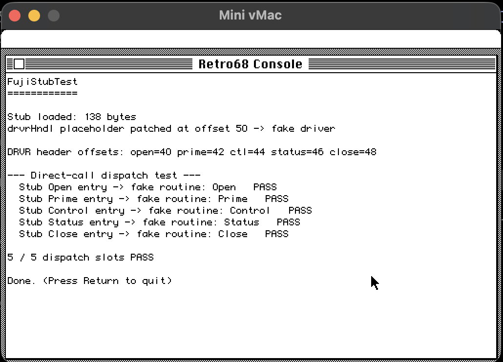

ROADMAP
=======

This document captures the direction of the **Retro68 port** of
mac68k-fujinet-serial. The original THINK C build remains the
reference implementation; everything described here is additive and
lives under `retro68/`.

The granular, in-flight task list is in `issues.jsonl` (use the
`/issues` skill in Claude Code to view it). This file describes the
phases those issues fit into.

## Why a Retro68 port?

The repo as published builds with THINK C inside a classic Mac OS
environment (real hardware or an emulator). That works, but it puts
contributors behind a real barrier:

* requires a System 6/7 install, a THINK C licence/installer, and an
  emulator that can host the IDE (effectively Basilisk II);
* makes incremental builds slow and CI essentially impossible;
* puts the source under a closed-source toolchain that hasn't been
  updated since the late 1990s.

Retro68 is a modern GNU toolchain (GCC 12, GAS, ld, Rez) that targets
classic Mac OS. Once the port lands, building any target is
`cmake --build .` from a normal terminal, and the produced `.APPL` /
`.dsk` artifacts run under Mini vMac and Basilisk II.

## Phases

### Phase 1 — Toolchain and proof-of-concept (done)

* **#1** Install Retro68 locally and verify with a hello-world
  `.APPL` running in Mini vMac.
* **#3** Port the smallest target (`FujiSerialStub` — the .Fuji
  name-stub driver) to demonstrate the Retro68 build pattern for
  classic-Mac code resources. Source is now `retro68/FujiSerialStub/`,
  written as standalone GNU `as` rather than THINK C inline asm.

The resulting `FujiSerialStub.rsrc.bin` is byte-equivalent to what
THINK C would produce and dispatches correctly when invoked
(see Phase 2).

### Phase 2 — Runtime validation (done)

* **#8** Build a Retro68 test app (`FujiStubTest.APPL`) that loads
  the stub resource, patches its `drvrHndl` placeholder to a
  controllable fake destination DRVR, and confirms that all five
  dispatch slots (Open/Prime/Control/Status/Close) reach the
  correct fake routine. **Verified 5/5 PASS in Mini vMac.** Full
  device-manager (PBControl/PBStatus/...) coverage is deferred
  until a real `.Fuji` driver exists to install (Phase 3).

  

### Phase 3 — Real driver port

* **#5** Port the preferred async `.Fuji` driver
  (`FujiSerial/FujiSerialAsync.c`) to Retro68. This is the first
  port to exercise `FujiCommon/FujiInterfaces.h` and the
  `THINK_C` / `THINK_CPLUS` conditional compilation paths against
  GCC. Once it builds, the `FujiStubTest` harness can be extended
  to install a real `.Fuji` and exercise the stubs through
  `OpenDriver` / `PBControl` / etc.

### Phase 4 — Test app and dependencies

* **#2** Source Apple Universal Interfaces 3.x and drop them into
  Retro68's `InterfacesAndLibraries/`. Required for any code path
  that uses MacTCP — Multiversal Interfaces (Retro68's bundled
  open-source headers) deliberately omit it.
* **#4** Set up Basilisk II with a Quadra-class ROM and a System
  7.5+ disk image. Needed for testing the full driver stack at
  realistic memory sizes and (eventually) for MacTCP work.
* **#6** Port `FujiTests` (`FloppyTests.c`, `SerialTests.c`,
  `TCPTests.c`). The TCP tests depend on #2.

### Phase 5 — User-facing

* **#7** Port `FujiDeskAcc`, the Desk Accessory that actually wires
  the drivers into the unit table for end users. DA packaging under
  Retro68 is the trickiest target (no direct sample, layout has to
  be assembled from the SystemExtension / WDEF patterns). Depends
  on the driver ports and a runtime-tested test app.

## Out of scope (for now)

* PowerPC / Carbon builds. Retro68 supports them, but everything in
  this repo is 68k-native.
* Replacing the THINK C `.proj.bin` files. Both build systems will
  coexist — the THINK C projects remain the reference for anyone
  contributing from a classic Mac.
* Restructuring the existing C sources beyond what's required to
  build under both toolchains. Diff size against upstream should be
  kept as small as possible.

## How to contribute

1. Pick (or file) an issue in `issues.jsonl`.
2. Read `BUILDING-RETRO68.md` and confirm your toolchain works
   end-to-end (hello-world `.APPL` boots in Mini vMac).
3. Add your work under `retro68/<TargetName>/` following the patterns
   established by `FujiSerialStub` (assembly / code resource) or
   `FujiStubTest` (full application).
4. Update `issues.jsonl` as work moves between open / in-progress /
   done. Don't mark `done` until the change has been runtime-tested
   in an emulator.
